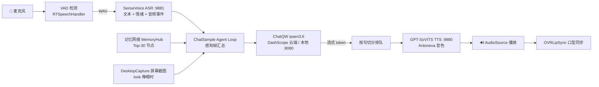

# NeEEvA

基于 Unity 的 AI 虚拟角色语音伴侣。VRM 虚拟形象「アントネーワ（安托涅瓦，出自《永远的7日之都》）」在 3D 房间场景中与用户进行实时日语语音对话，支持流式回复、语音打断、实时屏幕视觉、口型同步、图谱式长期记忆与 Agent Loop 自主行为调度。

## 主要特性

- **VRM 1.0 虚拟形象**：基于 UniVRM 0.129.1，实时口型同步（OVRLipSync）、自动眨眼、姿态动画切换
- **实时语音对话链路**：麦克风 VAD 检测 → 本地 SenseVoice 语音识别（附带情绪 / 音频事件标签）→ LLM 流式生成 → 按句切分排队 TTS → 边合成边播放边显示
- **低延迟交互**：支持对话打断（barge-in，约 0.3s 响应）、试探性断句（tentative EOU，0.6s 静默即预判句尾）以减少等待；`<continue/>` 无缝续写、`<silent/>` 内心独白（只记录不朗读）
- **实时屏幕视觉**：主推的 qwen3.6 多模态模型可以"看"用户的电脑屏幕——角色自主输出 `<look/>` 睁眼后，每一帧感知都附最新桌面截图，能实时感知画面变化，`<unlook/>` 闭眼（详见下文「启用 Qwen3.6 与实时视觉」）
- **Agent Loop 自主行为**：角色不是被动应答机——她通过 `<next/>` 标签自主排定下一次"思考"时刻，可以主动搭话、安静等待，或被环境声响拉回注意力（详见「Agent Loop」一节）
- **图谱式长期记忆**：带权重的记忆节点 + 语义边构成知识网络（`seed_memory.json` 含 21 个种子节点），运行时持久化到 `Application.persistentDataPath/memory.json`，每帧按"权重 × 新近度"把 Top-30（可调）节点注入感知帧
- **多 LLM 后端可插拔**：DeepSeek、通义千问（DashScope 云端 / llama-server、Ollama 本地双后端）、OpenAI、智谱 ChatGLM、讯飞星火、RWKV
- **多语音服务可选**：本地 SenseVoice ASR、GPT-SoVITS 声音克隆 TTS，以及 OpenAI / Azure / 讯飞 云端 TTS & STT
- **Qwen-Omni 多模态**：文本 + 语音 + 摄像头 / 截图输入，流式文本与音频输出（`qwen-omni-turbo`）
- **语音唤醒（WOV）**：通过语音触发激活对话

## 系统架构



默认端口一览（均可在对应组件 / 启动脚本中修改）：

| 服务 | 默认地址 | 用途 |
|---|---|---|
| SenseVoice ASR | `127.0.0.1:9881` | 本地语音识别（附情绪 / 音频事件标签） |
| GPT-SoVITS TTS | `127.0.0.1:9880` | 本地声音克隆语音合成 |
| 本地 LLM（llama-server / Ollama） | `127.0.0.1:8080` | qwen3.6 本地推理（含视觉） |
| DashScope（可选云端） | `dashscope.aliyuncs.com` | 千问云端推理 / Qwen-Omni |

## 环境要求

- Unity **2022.3.22f1**
- 可选的本地服务（按需启用）：
  - **本地语音识别 SenseVoice**：✅ 服务端已包含在仓库中（`Server/SenseVoice`），Python 3.10+，`pip install` 后开箱即用，模型权重首次启动自动下载
  - **本地声音克隆 TTS GPT-SoVITS**：⚠️ git 仓库只包含 Unity 调用端与启动脚本；完整服务端（含便携 runtime 与 Antoneva 音色）约定放在项目根目录 `GPT-SoVITS/`，双击 `start_tts_server.bat` 启动（默认 `127.0.0.1:9880`），克隆用户需自行部署（见下文「部署 GPT-SoVITS」）
  - **本地 LLM qwen3.6-35b-a3b**：llama.cpp llama-server（默认 `127.0.0.1:8080`），模型与视觉投影 GGUF 需自行下载（见「本地部署 qwen3.6-35b-a3b」小节）

## 快速开始

1. 用 Unity Hub 打开本项目（首次导入会重新生成 `Library/`，耗时较长）。
2. 打开主对话场景 `Assets/AIChatTookit/Scene/chatSample.unity`（包含 NeEEvA 形象与完整对话栈；`Assets/Scenes/NeEEvARoom.unity` 是由编辑器菜单 `NeEEvA > Build Room (White-box)` 生成的白盒房间场景）。
3. 在场景内对应组件的 Inspector 中填入自己的 API Key（**仓库不包含任何密钥**；LLM 走本地 llama-server / Ollama 后端时无需密钥，可跳过）：
   - LLM：`ChatQW`（主推，见下节）/ `ChatDeepSeek` 等组件的 `api_key`
   - Qwen-Omni：`QwenOmni` 组件的 `api_key`（阿里云百炼 DashScope）
4. （可选）启动本地语音识别服务（服务端代码已在仓库中，SenseVoiceSmall 模型权重首次启动时会自动从 ModelScope 下载）：

   ```bash
   cd Server/SenseVoice
   pip install -r requirements.txt
   python sensevoice_server.py              # 默认 cuda:0，监听 127.0.0.1:9881
   python sensevoice_server.py --device cpu # CPU 模式
   ```

5. （可选）启动 GPT-SoVITS 声音克隆 TTS：双击 `GPT-SoVITS\start_tts_server.bat`（该文件夹在本机开发环境中已内置完整服务端与 Antoneva 音色；克隆用户需先按下文「部署 GPT-SoVITS」自行部署）。
6. 运行场景，开始对话。

## 启用 Qwen3.6 与实时视觉（屏幕感知）

项目主推的 LLM 是 **qwen3.6-35b-a3b**（多模态，支持视觉输入）。视觉附图只在 `ChatQW` 后端实现（`ChatQW.PostMsgStream` 的 `imageDataUrl` 重载），其他 LLM 后端不支持——想用实时视觉就必须把对话模型切到 Qwen。

### 1. 选择 Qwen 作为对话模型

在 `chatSample.unity` 中选中挂有 `ChatSample` 的对象，在 Inspector 的 `Chat Settings` 里把 `m_ChatModel` 指向场景中的 `ChatQW` 组件。

### 2. 配置 ChatQW 后端（二选一）

`ChatQW` 组件的 `m_Backend` 支持两种后端：

| 字段 | 云端（Cloud，阿里云百炼） | 本地（Local，llama-server / Ollama） |
|---|---|---|
| `m_Backend` | `Cloud` | `Local` |
| 模型名 | `m_ChatModelName`，如 `qwen3.6-35b-a3b`（需选支持视觉的版本，以百炼接口文档为准） | `m_LocalModelName`：llama-server 为单模型服务、会忽略请求里的模型名，随意填即可（场景当前填 `antoneva`）；Ollama 则需与已加载模型名一致 |
| `api_key` | 必填（百炼平台申请） | 留空即可（本地服务不校验） |
| 地址 | 自动使用 DashScope 兼容模式接口 | `m_LocalUrl`，默认 `http://127.0.0.1:8080/v1/chat/completions` |

#### 本地部署 qwen3.6-35b-a3b（llama.cpp，含视觉）

qwen3.6-35b-a3b 是 MoE 模型（总参 35B / 每次前向仅激活 3.6B），量化后可在消费级显卡上流畅运行，且原生支持视觉输入。

**① 下载 llama.cpp**：从 [llama.cpp Releases](https://github.com/ggml-org/llama.cpp/releases) 下载 Windows 预编译包（NVIDIA 显卡选 `cuda` 版并连同 `cudart` 运行库包一起解压；无 N 卡可用 Vulkan / CPU 版），解压到任意目录（如 `E:\llamacpp`）。

**② 下载模型 + 视觉投影**：从 Hugging Face 任选一个 GGUF 仓库——[unsloth/Qwen3.6-35B-A3B-MTP-GGUF](https://huggingface.co/unsloth/Qwen3.6-35B-A3B-MTP-GGUF)、[bartowski/Qwen_Qwen3.6-35B-A3B-GGUF](https://huggingface.co/bartowski/Qwen_Qwen3.6-35B-A3B-GGUF) 或 [lmstudio-community/Qwen3.6-35B-A3B-GGUF](https://huggingface.co/lmstudio-community/Qwen3.6-35B-A3B-GGUF)（国内可走 hf-mirror.com 镜像或 ModelScope）。需要两个文件：

- 模型本体：选一个量化档，`Q4_K_M` 约 18GB 起步，显存充裕可选更高精度
- **视觉投影 `mmproj-*.gguf`**（同仓库内）：**必须下载**，没有它模型就"看不见"，带图请求会被拒绝

```bash
huggingface-cli download unsloth/Qwen3.6-35B-A3B-MTP-GGUF --include "*Q4_K_M*,mmproj*" --local-dir E:\llamacpp
```

文件名可自行改短（本项目环境命名为 `qwen36.gguf` / `mmproj-Q8_0.gguf`）。

**③ 启动 llama-server**（本项目实际使用的参数）：

```bash
llama-server.exe -m qwen36.gguf --mmproj mmproj-Q8_0.gguf --host 127.0.0.1 --port 8080 -c 16384 --parallel 1 -ngl 99 --jinja --flash-attn on
```

- `-ngl 99`：全部层载入 GPU；显存不足时可调小，或加 `--n-cpu-moe N` 把部分 MoE 专家层放内存，用速度换显存
- `-c 16384`：上下文长度。视觉 token 消耗大，建议不低于 16K
- `--jinja`：使用模型内置对话模板；`--flash-attn on`：开启 FlashAttention
- 模型加载约 30–60 秒；浏览器访问 `http://127.0.0.1:8080/health` 返回 ok 即就绪，之后 Unity 侧无需任何额外配置即可对话

其他相关字段：

- `m_EnableThinking`：Qwen3 / 3.6 思考模式开关，默认关闭（可大幅缩短首 token 延迟），云端/本地均生效
- `m_KeepRecentImages`：多模态历史滑窗，默认 `2`——只保留最近 N 条带图消息的图片，更早的自动剥图只留文字，防止视觉 token 撑爆上下文

### 3. 配置 ChatSample 的视觉参数

`ChatSample` 组件 Inspector 的「视觉(屏幕感知)」区：

- `m_EnableScreenVision`：视觉总开关（默认开）。关闭后角色永远闭眼，`<look/>` 也不生效
- `m_CaptureMode`：截屏范围——`ActiveWindow` 跟随当前前台窗口所在显示器（推荐，自动跟随你的注意力）/ `Primary` 主屏 / `Specific` 按 `m_MonitorIndex` 指定显示器
- `m_CaptureMaxDimension`：截图最长边像素，默认 `1280`（等比缩放，平衡画质与 token）
- `m_CaptureJpegQuality`：JPEG 质量，默认 `80`

### 4. 运行时如何"看见"

视觉由角色在 Agent Loop 中**自主控制**，不需要手动按键：

1. 启动会话后角色默认闭眼，感知帧会提示她「闭眼(用 `<look/>` 可以睁眼)」
2. 当你提到屏幕内容（比如"看看这段代码""这个网页怎么样"），她会在回复末尾输出 `<look/>` 睁眼
3. 睁眼状态是**持久的**：之后每一帧感知都会自动附上最新的桌面截图（约 50–150ms 一次 GDI 截屏 → JPEG → base64，随对话节奏发送），所以她能实时感知画面变化——切换窗口、滚动页面、播放视频
4. 她认为不需要再看时会输出 `<unlook/>` 闭眼，停止图像输入以节省视觉 token

限制：仅支持 Windows 平台（GDI P/Invoke 截屏）；只能看到屏幕，没有摄像头通道（单次的摄像头/截图问答请用 `QwenOmni` 模块）。

## Agent Loop：角色的自主行为

角色不是"一问一答"的被动应答机。`ChatSample` 以**感知帧**驱动 Agent Loop：每一帧把「用户最新发言、她自己最近说过什么、环境声响、会话阶段、视觉状态、记忆库 Top-N 节点」汇总给 LLM，由角色自己决定说话还是沉默、下次何时"想起来"。她通过在回复**末尾**输出标签控制自己的行为：

| 标签 | 作用 |
|---|---|
| `<next in="10s" focus="…"/>` | 排定下一次自主思考的时刻，`focus` 是写给自己的注意力备忘 |
| `<continue/>` | 立刻接着说下一帧（讲故事、长解释时的链式续写） |
| `<silent/>` | 本轮只在心里想：文字进入记录但不朗读、不显示 |
| `<look/>` / `<unlook/>` | 睁眼 / 闭眼，开关屏幕视觉（见上节） |

配套机制：连续多轮无用户回应会强制等待用户开口（`m_MaxConsecutiveAITurns`，默认 8，防独白循环）；环境突发声响可把下一次思考拉前（`m_BringForwardOnSpike`），模拟"被动静拽回注意力"；感知帧还会回显她最近几条发言，提醒她避免重复车轱辘话。相关提示词约定见 `Assets/AIChatTookit/Prompts/behavior.txt`。

## 部署 GPT-SoVITS 声音克隆 TTS（可选）

项目约定 GPT-SoVITS 服务端放在**项目根目录的 `GPT-SoVITS/` 文件夹**，一键启动：

```
双击 GPT-SoVITS\start_tts_server.bat    # 监听 127.0.0.1:9880，加载 Antoneva 音色
```

该文件夹包含便携 Python runtime、v2Pro 底模、Antoneva 音色权重（`GPT_weights_v2Pro/Antoneva-e15.ckpt` + `SoVITS_weights_v2Pro/Antoneva_e8_s96.pth`，已在 `GPT_SoVITS/configs/tts_infer.yaml` 的 `custom` 段配好）和参考音频 `sourceVoice/antoneva.wav`——Unity 场景中 `GPTSoVITSFASTAPI` 组件的参考音频路径、参考文本与语言均已按此预配置，启动服务即可直接对话。

⚠️ 由于体积约 12GB，`GPT-SoVITS/` 未纳入 git 仓库（仅启动脚本入库）。克隆本仓库的用户需按下述步骤自行部署到同名文件夹：

1. 下载并安装 [GPT-SoVITS](https://github.com/RVC-Boss/GPT-SoVITS)（源码或官方整合包均可），准备好自己训练/下载的 GPT 与 SoVITS 音色权重。
2. 以 **api_v2** 模式启动推理服务（Unity 端对接的是 `/tts` 接口）：

   ```bash
   python api_v2.py -a 127.0.0.1 -p 9880 -c GPT_SoVITS/configs/tts_infer.yaml
   ```

   在 `tts_infer.yaml`（或启动后通过 `/set_gpt_weights`、`/set_sovits_weights` 接口）指定要加载的音色权重。
3. 准备一段 3–10 秒的参考音频，放在 **GPT-SoVITS 项目目录**下（`ref_audio_path` 按服务端工作目录的相对路径解析）。场景当前预配置的路径是 `sourceVoice/antoneva.wav`，按此放置可免改 Unity 侧配置。
4. 如需换音色/参考音频，在 Unity 场景中选中挂有 `GPTSoVITSFASTAPI` 的对象，在 Inspector 中调整（场景已按 Antoneva 预填好）：
   - `m_ReferWavPath`：参考音频相对 GPT-SoVITS 项目目录的路径（当前为 `sourceVoice\antoneva.wav`）
   - `m_ReferenceText`：参考音频的文字内容（须与音频实际语音一致）
   - `m_ReferenceTextLan` / `m_TargetTextLan`：参考音频语言 / 合成目标语言（当前均为日文）
   - `m_PostURL`：默认 `http://127.0.0.1:9880/tts`，服务端不在本机时改成对应地址
5. 在 `ChatSample` 组件 Inspector 的 `Chat Settings` 里把 `m_TextToSpeech` 指向该 `GPTSoVITSFASTAPI` 组件即可。组件带 `WarmUp()` 预热：启动会话时自动发一条极短合成请求，把模型加载进显存，消除首次合成 2–4 秒的冷启动延迟。

## 常见问题

- **GPT-SoVITS 启动后 `tts_infer.yaml` 被改动了**：api_v2 加载权重时会自动规范化该文件（归一 `version` 字段、补全各版本默认段），属正常行为，音色配置不受影响，无需改回。
- **没有 NVIDIA 显卡 / CUDA 报错**：SenseVoice 改用 `python sensevoice_server.py --device cpu`；GPT-SoVITS 把 `GPT-SoVITS/GPT_SoVITS/configs/tts_infer.yaml` 中 `custom` 段的 `device` 改为 `cpu`、`is_half` 改为 `false`（CPU 模式合成速度明显变慢）。
- **她听不到我说话**：确认 SenseVoice 服务窗口在监听 `9881`；检查 Windows 设置 → 隐私 → 麦克风已允许桌面应用访问；再看 Unity Console 是否有 ASR 请求报错。
- **有回复文字但没有声音**：确认 GPT-SoVITS 服务窗口在监听 `9880`；注意 `m_ReferWavPath` 按**服务端工作目录**的相对路径解析，移动过参考音频需两侧同步改。
- **端口被占用**：三个本地服务的端口都可改（启动脚本参数 / Unity 组件里的 URL 字段），改完保持两侧一致。
- **首次对话前几秒没反应**：模型冷启动所致。GPT-SoVITS 已内置 WarmUp 预热，SenseVoice 启动时也会自动预热，一般只影响服务刚启动后的第一句。

## 项目结构

```
Assets/
  AIChatTookit/       对话框架
    Scripts/LLM/        各 LLM 接入（DeepSeek / QW / chatGPT / chatGLM / SparkAI / RWKV / Ollama）
    Scripts/TTS&&STT/   语音合成与识别（SenseVoice / GPT-SoVITS / OpenAI / Azure / Xunfei / Whisper）
    Scripts/Chat/       对话编排（流式管线、实时语音、打断处理、DesktopCapture 桌面截屏视觉）
    Scripts/Memory/     图谱式长期记忆（MemoryHub / MemoryStore / MemoryRecall）
    Scripts/Expression/ 口型同步、眨眼等表情控制
    Scripts/WOV/        语音唤醒
    QwenOmni/           通义千问 Omni 多模态接入
    Scene/              chatSample 主对话场景（NeEEvA 形象 + 完整对话栈）
    Prompts/            角色人设 / 行为 / 语言提示词
    MemoryData/         种子记忆 seed_memory.json
  Model/              NeEEvA.vrm 虚拟形象及贴图
  Scenes/             NeEEvARoom 白盒房间场景（由 NeEEvA > Build Room 编辑器菜单生成）
  VRM10/ UniGLTF/     UniVRM 0.129.1（VRM 1.0 运行时，内嵌源码）
Server/
  SenseVoice/         本地语音识别服务（FastAPI + FunASR）
GPT-SoVITS/           本地声音克隆 TTS 服务端（约 12GB，未入库，仅 start_tts_server.bat 在仓库中）
```

## 致谢 / 第三方

- [AIChatToolkit](https://github.com/zhangliwei7758/unity-AI-Chat-Toolkit)（MIT，作者 zhangliwei7758）— Unity AI 对话框架，本项目在其基础上做了大量扩展（Agent Loop、屏幕视觉、记忆网络、SenseVoice/GPT-SoVITS 接入等）
- [UniVRM / UniGLTF](https://github.com/vrm-c/UniVRM) v0.129.1（MIT）— VRM Consortium，VRM 1.0 运行时
- Oculus OVRLipSync — 口型同步（Oculus SDK 许可）
- [SenseVoice](https://github.com/FunAudioLLM/SenseVoice) / [FunASR](https://github.com/modelscope/FunASR) — 阿里通义实验室语音识别模型与推理框架
- [GPT-SoVITS](https://github.com/RVC-Boss/GPT-SoVITS)（MIT）— 少样本声音克隆 TTS

## 注意事项

- 所有 API 密钥均不包含在仓库中，需自行申请并在 Inspector 中填写。
- `Library/`、`Logs/`、`UserSettings/` 等 Unity 生成目录已被 `.gitignore` 排除，克隆后首次打开 Unity 会自动重新生成；`GPT-SoVITS/` 同样未入库（约 12GB）。
- 本仓库未附带整体开源许可证；所引用的第三方组件遵循各自的原始许可证。
- 角色与相关设定仅用于学习交流。
