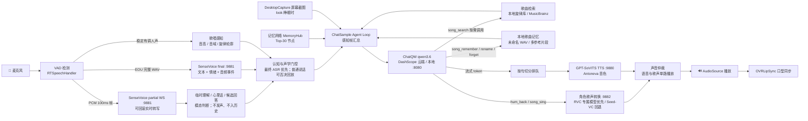

# NeEEvA

基于 Unity 的 AI 虚拟角色语音伴侣。VRM 虚拟形象「アントネーワ（安托涅瓦，出自《永远的7日之都》）」在 3D 房间场景中与用户进行实时日语语音对话，支持流式回复、语音打断、歌唱与哼唱感知、实时屏幕视觉、口型同步、图谱式长期记忆与 Agent Loop 自主行为调度。

## 主要特性

- **VRM 1.0 虚拟形象**：基于 UniVRM 0.129.1，实时口型同步（OVRLipSync）、自动眨眼、姿态动画切换
- **实时语音对话链路**：麦克风 VAD 检测 → WebSocket 增量转写与可撤销的临时理解 / 心里话 / 候选回答 → EOU 完整 SenseVoice 校正（附带情绪 / 音频事件标签）→ LLM 流式生成 → 按句切分排队 TTS → 边合成边播放边显示
- **低延迟交互**：支持对话打断（barge-in，约 0.3s 响应）、试探性断句（tentative EOU，0.6s 静默即预判句尾）以减少等待；`<continue/>` 无缝续写、`<silent/>` 内心独白（只记录不朗读）
- **歌唱、哼唱感知与角色演唱**：声学分析与临时语义判断共同区分普通说话、歌唱和“唱到一半改说话”；角色可查歌、把命名或未命名片段存入本地曲库、按顺序练唱、用自己的音色回唱，也可从已学曲库演唱或接唱可靠的后续片段
- **实时屏幕视觉**：主推的 qwen3.6 多模态模型可以"看"用户的电脑屏幕——角色自主输出 `<look/>` 睁眼后，每一帧感知都附最新桌面截图，能实时感知画面变化，`<unlook/>` 闭眼（详见下文「启用 Qwen3.6 与实时视觉」）
- **Agent Loop 自主行为**：角色不是被动应答机——她通过 `<next/>` 标签自主排定下一次"思考"时刻，可以主动搭话、安静等待，或被环境声响拉回注意力（详见「Agent Loop」一节）
- **图谱式长期记忆（可读写）**：带权重的记忆节点 + 语义边构成知识网络（`seed_memory.json` 含 21 个种子节点），运行时持久化到 `Application.persistentDataPath/memory.json`，每帧按"权重 × 新近度"把 Top-30（可调）节点注入感知帧；角色可通过 `<memory_add/>` / `<memory_update/>` 标签自主写入新记忆，权重随时间半衰期衰减（默认 180 天减半，有下限保护）；Editor 菜单 `NeEEvA > Memory Graph` 提供记忆网络的力导向图查看与编辑（Play 模式可直连运行实例实时观察写入）
- **情境记忆召回（"既视感"）**：当前对话与某段旧记忆语义相似时，即使它排不进核心 Top-30，也会作为「此刻被唤起的记忆」浮进感知帧——由语义嵌入检索 + 沿记忆网络边的扩散激活双机制驱动（详见「情境记忆召回」一节）
- **多 LLM 后端可插拔**：DeepSeek、通义千问（DashScope 云端 / llama-server、Ollama 本地双后端）、OpenAI、智谱 ChatGLM、讯飞星火、RWKV
- **多语音服务可选**：本地 SenseVoice ASR、GPT-SoVITS 声音克隆 TTS，以及 OpenAI / Azure / 讯飞 云端 TTS & STT
- **Qwen-Omni 多模态**：文本 + 语音 + 摄像头 / 截图输入，流式文本与音频输出（`qwen-omni-turbo`）
- **语音唤醒（WOV）**：通过语音触发激活对话

## 系统架构



默认端口一览（均可在对应组件 / 启动脚本中修改）：

| 服务 | 默认地址 | 用途 |
|---|---|---|
| SenseVoice ASR / 歌唱感知 | `127.0.0.1:9881` | 本地语音识别、音高/旋律分析与歌曲检索编排 |
| GPT-SoVITS TTS | `127.0.0.1:9880` | 本地声音克隆语音合成 |
| 角色歌声转换（RVC 优先） | `127.0.0.1:9882` | 用专属角色模型转换用户演唱；Seed-VC 作为无专属模型时的回退 |
| 本地 LLM（llama-server / Ollama） | `127.0.0.1:8080` | qwen3.6 本地推理（含视觉） |
| 本地嵌入服务（可选） | `127.0.0.1:8090` | 为情境记忆提供语义向量；不启动时自动退回名字提及与扩散激活 |
| DashScope（可选云端） | `dashscope.aliyuncs.com` | 千问云端推理 / Qwen-Omni |

## 环境要求

- Unity **2022.3.22f1**
- 可选的本地服务（按需启用）：
  - **本地语音识别 SenseVoice**：✅ 服务端已包含在仓库中（`Server/SenseVoice`），Python 3.10+，`pip install` 后开箱即用，模型权重首次启动自动下载
  - **本地声音克隆 TTS GPT-SoVITS**：⚠️ git 仓库只包含 Unity 调用端与启动脚本；完整服务端（含便携 runtime 与 Antoneva 音色）约定放在项目根目录 `GPT-SoVITS/`，双击 `start_tts_server.bat` 启动（默认 `127.0.0.1:9880`），克隆用户需自行部署（见下文「部署 GPT-SoVITS」）
  - **本地歌声转换 RVC / Seed-VC**：✅ 桥接服务位于 `Server/SeedVC`，有 `Server/RVC/models/neeeva_character.pth` 时优先使用角色专属 RVC v2 模型，否则回退到 Seed-VC；首次使用 Seed-VC 可能下载约 2.4 GB 权重
  - **本地 LLM qwen3.6-35b-a3b**：llama.cpp llama-server（默认 `127.0.0.1:8080`），模型与视觉投影 GGUF 需自行下载（见「本地部署 qwen3.6-35b-a3b」小节）

## 快速开始

1. 用 Unity Hub 打开本项目（首次导入会重新生成 `Library/`，耗时较长）。
2. 打开主对话场景 `Assets/AIChatTookit/Scene/chatSample.unity`（包含 NeEEvA 形象与完整对话栈；`Assets/Scenes/NeEEvARoom.unity` 是由编辑器菜单 `NeEEvA > Build Room (White-box)` 生成的白盒房间场景）。
3. 在场景内对应组件的 Inspector 中填入自己的 API Key（**仓库不包含任何密钥**；LLM 走本地 llama-server / Ollama 后端时无需密钥，可跳过）：
   - LLM：`ChatQW`（主推，见下节）/ `ChatDeepSeek` 等组件的 `api_key`
   - Qwen-Omni：`QwenOmni` 组件的 `api_key`（阿里云百炼 DashScope）
4. （可选）启动本地语音识别服务（服务端代码已在仓库中，SenseVoiceSmall 模型权重首次启动时会自动从 ModelScope 下载）：

   ```bash
   cd Server/SenseVoice
   pip install -r requirements.txt
   python sensevoice_server.py              # 默认 cuda:0，监听 127.0.0.1:9881
   python sensevoice_server.py --device cpu # CPU 模式
   ```

   服务同时提供 `ws://127.0.0.1:9881/stream/asr`。实时对话开启后，Unity 会发送
   16kHz mono PCM16 小帧并接收可回滚的 `partial`；用户说完后仍调用 `/asr` 做最终校正。
   `partial` 形成的理解、内心反应、模态判断与候选回答只存在于本轮内存中，不会写入聊天历史或长期记忆。
   `requirements.txt` 同时安装 torchcrepe；未安装或运行失败时会自动回落到内置 FFT 音高跟踪器，普通 ASR 不受影响。

5. （可选）启动 GPT-SoVITS 声音克隆 TTS：双击 `GPT-SoVITS\start_tts_server.bat`（该文件夹在本机开发环境中已内置完整服务端与 Antoneva 音色；克隆用户需先按下文「部署 GPT-SoVITS」自行部署）。
6. （可选，角色真人感演唱）首次运行 `Server\SeedVC\install_seedvc.ps1`。之后 Unity 会在场景启动及每次演唱前检查 `9882`，服务未运行时自动静默启动 `Server\SeedVC\start_seedvc_server.ps1`；也可手工运行该脚本。自动启动日志位于 `Server\SeedVC\runtime\seedvc_server.log`。
   脚本会依次寻找 `NEEEVA_PYTHON_EXE`、`NEEEVA_GPT_SOVITS_ROOT\runtime\python.exe`、项目内 `GPT-SoVITS\runtime\python.exe` 和系统 `py -3.10`，无需修改源码。只有重新训练角色专属模型时才需要执行 `Server\RVC\install_rvc.ps1`；已有导出权重可直接由 `9882` 使用。
7. 运行场景，开始对话。

推荐按 `9881`（ASR）→ `9880`（TTS）→ `8080` 或云端 LLM 的顺序准备基础服务。`9882` 只在角色需要回唱、练唱或从曲库演唱时使用，默认可交给 Unity 按需拉起。可分别访问 `/health` 检查 `9881`、`9882` 和本地 LLM 是否已经就绪。

## 启用 Qwen3.6 与实时视觉（屏幕感知）

项目主推的 LLM 是 **qwen3.6-35b-a3b**（多模态，支持视觉输入）。视觉附图只在 `ChatQW` 后端实现（`ChatQW.PostMsgStream` 的 `imageDataUrl` 重载），其他 LLM 后端不支持——想用实时视觉就必须把对话模型切到 Qwen。

### 1. 选择 Qwen 作为对话模型

在 `chatSample.unity` 中选中挂有 `ChatSample` 的对象，在 Inspector 的 `Chat Settings` 里把 `m_ChatModel` 指向场景中的 `ChatQW` 组件。

### 2. 配置 ChatQW 后端（二选一）

`ChatQW` 组件的 `m_Backend` 支持两种后端：

| 字段 | 云端（Cloud，阿里云百炼） | 本地（Local，llama-server / Ollama） |
|---|---|---|
| `m_Backend` | `Cloud` | `Local` |
| 模型名 | `m_ChatModelName`，如 `qwen3.6-35b-a3b`（需选支持视觉的版本，以百炼接口文档为准） | `m_LocalModelName`：llama-server 为单模型服务、会忽略请求里的模型名，随意填即可（场景当前填 `antoneva`）；Ollama 则需与已加载模型名一致 |
| `api_key` | 必填（百炼平台申请） | 留空即可（本地服务不校验） |
| 地址 | 自动使用 DashScope 兼容模式接口 | `m_LocalUrl`，默认 `http://127.0.0.1:8080/v1/chat/completions` |

#### 本地部署 qwen3.6-35b-a3b（llama.cpp，含视觉）

qwen3.6-35b-a3b 是 MoE 模型（总参 35B / 每次前向仅激活 3.6B），量化后可在消费级显卡上流畅运行，且原生支持视觉输入。

**① 下载 llama.cpp**：从 [llama.cpp Releases](https://github.com/ggml-org/llama.cpp/releases) 下载 Windows 预编译包（NVIDIA 显卡选 `cuda` 版并连同 `cudart` 运行库包一起解压；无 N 卡可用 Vulkan / CPU 版），解压到任意目录（如 `E:\llamacpp`）。

**② 下载模型 + 视觉投影**：从 Hugging Face 任选一个 GGUF 仓库——[unsloth/Qwen3.6-35B-A3B-MTP-GGUF](https://huggingface.co/unsloth/Qwen3.6-35B-A3B-MTP-GGUF)、[bartowski/Qwen_Qwen3.6-35B-A3B-GGUF](https://huggingface.co/bartowski/Qwen_Qwen3.6-35B-A3B-GGUF) 或 [lmstudio-community/Qwen3.6-35B-A3B-GGUF](https://huggingface.co/lmstudio-community/Qwen3.6-35B-A3B-GGUF)（国内可走 hf-mirror.com 镜像或 ModelScope）。需要两个文件：

- 模型本体：选一个量化档，`Q4_K_M` 约 18GB 起步，显存充裕可选更高精度
- **视觉投影 `mmproj-*.gguf`**（同仓库内）：**必须下载**，没有它模型就"看不见"，带图请求会被拒绝

```bash
huggingface-cli download unsloth/Qwen3.6-35B-A3B-MTP-GGUF --include "*Q4_K_M*,mmproj*" --local-dir E:\llamacpp
```

文件名可自行改短（本项目环境命名为 `qwen36.gguf` / `mmproj-Q8_0.gguf`）。

**③ 启动 llama-server**（本项目实际使用的参数）：

```bash
llama-server.exe -m qwen36.gguf --mmproj mmproj-Q8_0.gguf --host 127.0.0.1 --port 8080 -c 16384 --parallel 1 -ngl 99 --jinja --flash-attn on
```

- `-ngl 99`：全部层载入 GPU；显存不足时可调小，或加 `--n-cpu-moe N` 把部分 MoE 专家层放内存，用速度换显存
- `-c 16384`：上下文长度。视觉 token 消耗大，建议不低于 16K
- `--jinja`：使用模型内置对话模板；`--flash-attn on`：开启 FlashAttention
- 模型加载约 30–60 秒；浏览器访问 `http://127.0.0.1:8080/health` 返回 ok 即就绪，之后 Unity 侧无需任何额外配置即可对话

其他相关字段：

- `m_EnableThinking`：Qwen3 / 3.6 思考模式开关，默认关闭（可大幅缩短首 token 延迟），云端/本地均生效
- `m_KeepRecentImages`：多模态历史滑窗，默认 `2`——只保留最近 N 条带图消息的图片，更早的自动剥图只留文字，防止视觉 token 撑爆上下文

### 3. 配置 ChatSample 的视觉参数

`ChatSample` 组件 Inspector 的「视觉(屏幕感知)」区：

- `m_EnableScreenVision`：视觉总开关（默认开）。关闭后角色永远闭眼，`<look/>` 也不生效
- `m_CaptureMode`：截屏范围——`ActiveWindow` 跟随当前前台窗口所在显示器（推荐，自动跟随你的注意力）/ `Primary` 主屏 / `Specific` 按 `m_MonitorIndex` 指定显示器
- `m_CaptureMaxDimension`：截图最长边像素，默认 `1280`（等比缩放，平衡画质与 token）
- `m_CaptureJpegQuality`：JPEG 质量，默认 `80`

### 4. 运行时如何"看见"

视觉由角色在 Agent Loop 中**自主控制**，不需要手动按键：

1. 启动会话后角色默认闭眼，感知帧会提示她「闭眼(用 `<look/>` 可以睁眼)」
2. 当你提到屏幕内容（比如"看看这段代码""这个网页怎么样"），她会在回复末尾输出 `<look/>` 睁眼
3. 睁眼状态是**持久的**：之后每一帧感知都会自动附上最新的桌面截图（约 50–150ms 一次 GDI 截屏 → JPEG → base64，随对话节奏发送），所以她能实时感知画面变化——切换窗口、滚动页面、播放视频
4. 她认为不需要再看时会输出 `<unlook/>` 闭眼，停止图像输入以节省视觉 token

限制：仅支持 Windows 平台（GDI P/Invoke 截屏）；只能看到屏幕，没有摄像头通道（单次的摄像头/截图问答请用 `QwenOmni` 模块）。

## Agent Loop：角色的自主行为

角色不是"一问一答"的被动应答机。`ChatSample` 以**感知帧**驱动 Agent Loop：每一帧把「用户最新发言、她自己最近说过什么、环境声响、会话阶段、视觉状态、记忆库 Top-N 节点」汇总给 LLM，由角色自己决定说话还是沉默、下次何时"想起来"。她通过在回复**末尾**输出标签控制自己的行为：

| 标签 | 作用 |
|---|---|
| `<next in="10s" focus="…"/>` | 排定下一次自主思考的时刻，`focus` 是写给自己的注意力备忘 |
| `<continue/>` | 立刻接着说下一帧（讲故事、长解释时的链式续写） |
| `<silent/>` | 本轮只在心里想：文字进入记录但不朗读、不显示 |
| `<look/>` / `<unlook/>` | 睁眼 / 闭眼，开关屏幕视觉（见上节） |
| `<memory_add name="…" desc="…" weight="0.7"/>` | 把值得长期记住的事写进记忆网络（跨会话持久化） |
| `<memory_update name="…" desc="…" weight="…"/>` | 修正/强化已有记忆，并刷新其激活时间 |
| `<song_search query="…" mode="auto"/>` | 按需查询本地旋律库与公开文字元数据 |
| `<song_remember/>` / `<song_rename/>` / `<song_forget/>` | 管理本地歌曲音频记忆 |
| `<song_sing mode="memory\|continue"/>` / `<hum_back mode="echo\|practice"/>` | 从长期曲库演唱、可靠接唱，或回唱当前练习片段 |

配套机制：连续多轮无用户回应会强制等待用户开口（`m_MaxConsecutiveAITurns`，默认 8，防独白循环）；环境突发声响可把下一次思考拉前（`m_BringForwardOnSpike`），模拟"被动静拽回注意力"；感知帧还会回显她最近几条发言，提醒她避免重复车轱辘话。相关提示词约定见 `Assets/AIChatTookit/Prompts/behavior.txt`。

## 流式倾听、临时理解与心里话

用户尚未说完时，WebSocket partial 会持续触发一条**可撤销的认知支路**。它与最终回答使用不同的短提示，不朗读、不中断用户，也不直接写入聊天历史或长期记忆。每次更新包含：

| 字段 | 含义 | 是否持久化 |
|---|---|---|
| 普通说话文字 | SenseVoice 在 EOU 后给出的最终转写，是这一轮最权威的语义输入 | 进入当前对话 |
| 临时理解 | 根据尚未稳定的 partial 推测“用户现在可能想表达什么” | 否 |
| `inner_reaction` | 角色面对当前推测时的主观心里反应，可帮助提前准备语气和方向，但不能当作事实 | 否 |
| 候选回答 | 若用户此刻结束，角色可能说出口的草稿 | 否 |
| `observed_mode` / `mode_confidence` | 独立判断当前更像 `speech`、`singing` 还是 `uncertain`，供歌唱门控参考 | 否 |

最终 `/asr` 返回后，系统会重新比对临时理解与最终文字：足够一致时只把它作为**本轮一次性提示**交给正式 LLM，以缩短组织回答的时间；冲突时整份草稿作废。高置信度 `speech`（默认阈值 `0.82`）还会否决自动回唱，避免“角色答应下一轮跟唱，但用户其实在说话”时把普通语音复读出来；`singing` 判断只能支持最终声学结果，不能单独授权播放。

这里的 `inner_reaction` 不等于 Agent Loop 的 `<silent/>`：前者是倾听期间短暂、可撤销的内部状态，后者是角色在一次正式自主回合中选择“不说出口”的完整想法。当前实现已经允许**倾听分析与回答准备并行**；但对话 TTS、角色歌声仍经过同一声音仲裁器串行播放，因此还不是可以边聊天边同时合唱的完全独立音乐智能体。

## 情境记忆召回（"既视感"）

核心记忆 Top-30 之外的旧记忆平时是"休眠"的——感知帧的排序公式（权重 × 新近度）里没有任何一项和"当前在聊什么"有关，节点一多，久远的事就永远进不了她的视野。情境召回补上了这条"内容寻址"通路：当下的对话与某段旧记忆相似时，它会作为**「此刻被唤起的记忆」**（独立于核心列表的第二通道，默认最多 6 条）浮进感知帧，她会像人突然想起往事一样自然地接住它。

三个召回信号源，按可用性分层：

| 信号源 | 机制 | 时效 |
|---|---|---|
| 语义嵌入检索 | 用户发言 → 向量 → 对全库余弦相似度 Top-K（`EmbeddingClient`，需嵌入服务） | 异步，作用于紧随的续写/tick 帧（"说着说着想起来"） |
| 名字提及扫描 | 任一方发言中出现节点名 → 立即激活并刷新记忆时间 | 同步，当帧生效 |
| 扩散激活 | 被唤起/提及/写入的节点沿**有向边**把能量传给邻居（顺边全额、逆边打折、两跳衰减），激活值按半衰期（默认 3 分钟）自然消退 | 同步，"相关但不相似"的记忆也能被带热 |

### 启用语义嵌入（可选但推荐）

1. 部署一个 OpenAI 兼容的嵌入服务，二选一：
   - **本地**：再开一个 llama-server 实例加载嵌入模型（如 [bge-m3 GGUF](https://huggingface.co/gpustack/bge-m3-GGUF)，仅几百 MB）：
     ```bash
     llama-server -m bge-m3-Q8_0.gguf --embeddings --port 8090
     ```
   - **云端**：阿里云百炼 `https://dashscope.aliyuncs.com/compatible-mode/v1/embeddings`（模型如 `text-embedding-v4`，需 api_key）
2. 在场景中 `MemoryHub` 所在的 GameObject 上 **Add Component → EmbeddingClient**，按需改地址/模型名（默认指向 `127.0.0.1:8090`）。

不配嵌入服务也能用：语义检索自动停用，提及扫描和扩散激活照常工作。节点向量带磁盘缓存（`memory_embeddings.json`，与 memory.json 同目录），只有新增/被改写的节点会重新嵌入；换嵌入模型或服务地址时缓存整体自动失效重建。

## 歌唱感知、歌曲记忆与角色演唱

歌唱模式默认开启，无需在 Unity 中手工切换。短探测或 WebSocket partial 发现稳定有调人声后，`RTSpeechHandler` 会撤销普通语音的 tentative EOU，改用约 1.8 秒的停唱静默；与此同时，流式认知支路继续分析可能的歌词、意图与说话/歌唱模态。最终 `/asr` 返回歌词推测、歌唱概率、音域、旋律音符序列和音高稳定度，纯哼唱没有歌词也能成为有效片段。

播放前采用“最终 ASR + 声学结果 + 临时心里话”的联合门控：

- 最终文字明确是普通交流，或高置信度临时判断为 `speech` 时，不回放、不写入练唱序列，并尽量回滚这一轮误缓存的普通语音。
- 用户唱到一半改说“不会唱了”“忘词了”“先停一下”等，整轮标为混合输入，末尾口语优先交给 LLM 正常回应。
- “上一轮约好跟唱”只是预期，不是证据；可以在后台提前准备转换，但必须等最终门控通过才能真正播放。
- 临时 `singing` 判断只能为声学结果提供旁证，不能单独确认用户正在唱歌。

### 查歌与本地曲库

角色只有在确实想确认歌曲时才会输出 `<song_search query="..." mode="auto" reason="..."/>`。查询异步执行，结果在下一帧回到角色感知中；返回前模型被要求不得编造歌名。默认提供方：

- **本地哼唱曲库**：原始录音不离开本机，按移调不敏感的旋律 DTW 与歌词/标题线索匹配。元数据存放在 `Server/SenseVoice/song_catalog.json`，受管 WAV 存放在 `Server/SenseVoice/song_library/`；`GET /songs/catalog` 可查看记录摘要。
- **MusicBrainz**：有文字线索时查询公开歌曲元数据，只发送查询文字，不上传麦克风音频。它不提供歌词或旋律识别，因此结果永远只作为待核实候选，不能单独确认歌名。

`mode="auto"` 会按可用性组合上述提供方；`hum`、`catalog` 可限制检索类型。工具内置 12 秒冷却，候选低于可靠阈值时会明确告诉角色“不能确认”。项目没有接入 ACRCloud 等付费音频指纹服务。

角色可自主调用 `<song_remember/>` 保存最近一次**最终确认的演唱**。`title` 允许为空：系统会生成稳定歌曲 ID，并以 `unknown` 安全临时名保存 WAV；之后可用 `<song_rename/>` 同时更新元数据和实际文件名。相同歌词和旋律的重复录音会保存为同一段的不同演唱版本，不会被误当成歌曲的前后顺序；真正不同的片段才按练习顺序加入。`<song_forget/>` 会删除记录及其受管 WAV，因此仅在用户明确要求或刚刚明显误存时使用。

调用 `<song_remember/>` 只代表发起请求。只有 `9881` 返回落盘成功、歌曲 ID 和文件结果后，工具才把“已在本机记住”交还给角色；角色不得在提交请求的同一轮提前说“已经记住”。没有记忆标签的短哼声、单音和环境噪声不会落盘。

### 回唱、连续练唱与曲库演唱

| 动作 | 音频来源 | 行为 |
|---|---|---|
| `<hum_back mode="echo"/>` | 最近一次最终确认的演唱 | 回唱最近一句 |
| `<hum_back mode="practice"/>` | 本轮练唱会话中按顺序确认的不同片段 | 合成为一次连续演唱，重复段作为版本而非后续 |
| `<song_sing mode="memory"/>` | 本地长期曲库 | 演唱这首歌已经学会的独立片段 |
| `<song_sing mode="continue"/>` | 当前歌词/旋律位置 + 本地曲库 | 只接唱曲库中顺序明确、可靠匹配的后续已学片段 |

`continue` 不会凭空生成角色从未听过的旋律；所谓“完整演唱”目前是把已经学到且顺序明确的片段连续组织起来。每次演唱会使用不同的推理种子和受控的细微音高、力度等变化，所以同一首不会只是逐字节重放，但也不会为了制造差异而破坏原旋律。

Unity 会把 SenseVoice 保留的**真实原始演唱 WAV**交给本机 `9882` 转换桥。桥接服务优先使用由角色语音与哼声素材训练的专属 RVC v2 模型；专属模型不存在时，才使用 GPT-SoVITS 参考音频做 Seed-VC 零样本回退。音调关系、节奏、歌词/哼声、换气和细微抖动会尽量保留，音色则向角色靠近。只有服务返回可解码 WAV 且实际播放完成后，工具才报告成功；失败时默认不退回机械 TD-PSOLA，角色也不得用普通 TTS 念歌词来假装唱过。

转换等待和播放都可被 barge-in 打断，角色自己的歌声也不会被重新识别成用户输入。当前不支持严格同步的双人合唱：倾听和认知准备可以并行，真正可听见的说话与歌唱仍由同一声音仲裁器单路播放。

`ChatSample > 角色旋律回哼` 默认 `Enable Neural Hum SVC=true`、`Diffusion Steps=20`、`Auto F0 Adjust=true`、`Allow Legacy Hum Fallback=false`。Unity 日志中的 `backend=rvc-character-v2` 表示走角色专属模型；`backend=seed-vc` 表示走零样本回退。最近一次成功的 A/B 样本与元数据保存在 `Server/SeedVC/last_conversion/`（Git 忽略）。专属模型的训练与原曲翻唱流程见 [`Server/RVC/README.md`](Server/RVC/README.md)；桥接服务说明见 [`Server/SeedVC/README.md`](Server/SeedVC/README.md)。

手工添加仍可使用兼容接口，歌名同样可省略：

```powershell
curl.exe -X POST "http://127.0.0.1:9881/songs/catalog/remember" `
  -F "audio_file=@E:\Music\my_hum.wav;type=audio/wav" `
  -F "title=" `
  -F "reason=想保留的即兴旋律"
```

## 部署 GPT-SoVITS 声音克隆 TTS（可选）

项目约定 GPT-SoVITS 服务端放在**项目根目录的 `GPT-SoVITS/` 文件夹**，一键启动：

```
双击 GPT-SoVITS\start_tts_server.bat    # 监听 127.0.0.1:9880，加载 Antoneva 音色
```

该文件夹包含便携 Python runtime、v2Pro 底模、Antoneva 音色权重（`GPT_weights_v2Pro/Antoneva-e15.ckpt` + `SoVITS_weights_v2Pro/Antoneva_e8_s96.pth`，已在 `GPT_SoVITS/configs/tts_infer.yaml` 的 `custom` 段配好）和参考音频 `sourceVoice/antoneva.wav`——Unity 场景中 `GPTSoVITSFASTAPI` 组件的参考音频路径、参考文本与语言均已按此预配置，启动服务即可直接对话。

⚠️ 由于体积约 12GB，`GPT-SoVITS/` 未纳入 git 仓库（仅启动脚本入库）。克隆本仓库的用户需按下述步骤自行部署到同名文件夹：

1. 下载并安装 [GPT-SoVITS](https://github.com/RVC-Boss/GPT-SoVITS)（源码或官方整合包均可），准备好自己训练/下载的 GPT 与 SoVITS 音色权重。
2. 以 **api_v2** 模式启动推理服务（Unity 端对接的是 `/tts` 接口）：

   ```bash
   python api_v2.py -a 127.0.0.1 -p 9880 -c GPT_SoVITS/configs/tts_infer.yaml
   ```

   在 `tts_infer.yaml`（或启动后通过 `/set_gpt_weights`、`/set_sovits_weights` 接口）指定要加载的音色权重。
3. 准备一段 3–10 秒的参考音频，放在 **GPT-SoVITS 项目目录**下（`ref_audio_path` 按服务端工作目录的相对路径解析）。场景当前预配置的路径是 `sourceVoice/antoneva.wav`，按此放置可免改 Unity 侧配置。
4. 如需换音色/参考音频，在 Unity 场景中选中挂有 `GPTSoVITSFASTAPI` 的对象，在 Inspector 中调整（场景已按 Antoneva 预填好）：
   - `m_ReferWavPath`：参考音频相对 GPT-SoVITS 项目目录的路径（当前为 `sourceVoice\antoneva.wav`）
   - `m_ReferenceText`：参考音频的文字内容（须与音频实际语音一致）
   - `m_ReferenceTextLan`：参考音频语言（当前为日文）
   - `m_TargetLanguageMode`：默认“自动识别”，AI 改用中文、日文或英语时，每个 TTS 文本段会自动把 `text_lang` 切换为 `zh` / `ja` / `en`
   - `m_TargetTextLan`：固定模式下的目标语言，也是自动识别失败时的回退语言（当前为日文）
   - `m_WarmUpAllTargetLanguages`：启动时依次预热中/日/英三种语言，并缓存三条角色短回应，避免首次切换语言额外等待约 4–5 秒
   - `m_PostURL`：默认 `http://127.0.0.1:9880/tts`，服务端不在本机时改成对应地址
   - 运行时也可由受控 Agent 工具或 UI 调用 `TrySetTargetLanguage("auto" | "zh" | "ja" | "en")`；不在白名单内的值会被拒绝
   - `ChatSample` 的 `m_EnableLatencyFiller` 默认开启：根据历史首音延迟做移动平均预测，预计超过 `1.5s` 时约在 `0.65s` 播放预缓存短回应；正式首音到达后自然切入回答，不增加新的 SoVITS 请求
5. 在 `ChatSample` 组件 Inspector 的 `Chat Settings` 里把 `m_TextToSpeech` 指向该 `GPTSoVITSFASTAPI` 组件即可。组件带 `WarmUp()` 预热：启动会话时自动发一条极短合成请求，把模型加载进显存，消除首次合成 2–4 秒的冷启动延迟。

## 常见问题

- **GPT-SoVITS 启动后 `tts_infer.yaml` 被改动了**：api_v2 加载权重时会自动规范化该文件（归一 `version` 字段、补全各版本默认段），属正常行为，音色配置不受影响，无需改回。
- **没有 NVIDIA 显卡 / CUDA 报错**：SenseVoice 改用 `python sensevoice_server.py --device cpu`；GPT-SoVITS 把 `GPT-SoVITS/GPT_SoVITS/configs/tts_infer.yaml` 中 `custom` 段的 `device` 改为 `cpu`、`is_half` 改为 `false`（CPU 模式合成速度明显变慢）。
- **她听不到我说话**：确认 SenseVoice 服务窗口在监听 `9881`；检查 Windows 设置 → 隐私 → 麦克风已允许桌面应用访问；再看 Unity Console 是否有 ASR 请求报错。
- **启动 SenseVoice 报 `[WinError 10048]`**：`9881` 已经被另一个进程占用，最常见原因是 SenseVoice 已经在运行。先访问 `http://127.0.0.1:9881/health`；能正常返回就直接复用，不要再启动第二份。只有健康检查失败时才查找并结束旧进程，或把服务端口和 Unity URL 一起改掉。
- **看不到流式 partial**：重启 SenseVoice 服务并访问 `http://127.0.0.1:9881/health`，确认返回 `streaming_preview: true`；Unity 的 `SenseVoiceSpeechToText > Enable Streaming Preview` 与 `RTSpeechHandler > Enable Streaming Recognition` 也应开启。
- **唱歌仍被当成普通说话**：确认 `/health` 返回 `singing_analysis: true`；在 Unity 的 `RTSpeechHandler` 中保持 `Enable Singing Mode` 开启。远距离、严重混响或伴奏远强于人声时建议先清唱测试。
- **答应跟唱后，我改成说话却被原样复读**：应先看到最终普通 ASR 或日志中的临时 `mode=speech`，随后歌唱动作被 `speechVeto=True` 否决，且最终感知帧不再含 `[演唱片段]`。若仍复读，先确认 Unity 已重新编译最新脚本并重启 Play Mode；旧场景进程不会热切换已经运行中的门控状态。
- **她查不到歌名**：空的本地曲库只能使用文字目录候选；哼唱匹配需先向本地曲库加入参考歌曲。旋律片段太短、跑调较大或背景伴奏过强时只能返回低置信候选。
- **她说已经唱了，但没有声音 / 只是念歌词**：文字承诺不算演唱成功。检查 Unity Console 的 `[HumBack]` / `[SongSing]` 结果以及 `http://127.0.0.1:9882/health`；只有 `9882` 返回可解码 WAV 并实际播放完成，工具才会向角色报告成功。普通 GPT-SoVITS TTS 只能说话，不能代替有音调的演唱。
- **`9882` 没有自动启动**：查看 `Server/SeedVC/runtime/seedvc_server.log`；如 Python 未被自动找到，可设置 `NEEEVA_PYTHON_EXE` 为解释器完整路径，或设置 `NEEEVA_GPT_SOVITS_ROOT` 为 GPT-SoVITS 根目录。Unity 默认在场景启动和每次演唱前探测并按需启动；也可手工运行脚本后再访问 `/health`。
- **只唱到后半段，或连续两段间隔很久**：曲库会把相同歌词/旋律的多次录音当作同一段的不同版本，它们不能构成前后顺序。请按顺序教角色真正不同的片段并保存到同一歌曲 ID；`practice` 会尽量一次合成连续片段，`continue` 只接唱顺序明确的已学后续。
- **有回复文字但没有声音**：确认 GPT-SoVITS 服务窗口在监听 `9880`；注意 `m_ReferWavPath` 按**服务端工作目录**的相对路径解析，移动过参考音频需两侧同步改。
- **其他端口被占用**：`9880`、`9881`、`9882`、`8080`（以及可选 `8090`）都可在启动参数 / 脚本和 Unity 组件 URL 中修改，改完必须保持服务端与调用端一致。
- **首次对话前几秒没反应**：模型冷启动所致。GPT-SoVITS 已内置 WarmUp 预热，SenseVoice 启动时也会自动预热，一般只影响服务刚启动后的第一句。

## 项目结构

```
Assets/
  AIChatTookit/       对话框架
    Scripts/LLM/        各 LLM 接入（DeepSeek / QW / chatGPT / chatGLM / SparkAI / RWKV / Ollama）
    Scripts/TTS&&STT/   语音合成与识别（SenseVoice / GPT-SoVITS / OpenAI / Azure / Xunfei / Whisper）
    Scripts/Chat/       对话编排（流式管线、实时语音、打断处理、DesktopCapture 桌面截屏视觉）
    Scripts/Memory/     图谱式长期记忆（MemoryHub / MemoryStore / MemoryRecall）
    Scripts/Expression/ 口型同步、眨眼等表情控制
    Scripts/WOV/        语音唤醒
    QwenOmni/           通义千问 Omni 多模态接入
    Scene/              chatSample 主对话场景（NeEEvA 形象 + 完整对话栈）
    Prompts/            角色人设 / 行为 / 语言提示词
    MemoryData/         种子记忆 seed_memory.json
  Editor/             编辑器工具（NeEEvARoomBuilder 白盒房间生成、MemoryGraphWindow 记忆网络可视化编辑）
  Model/              NeEEvA.vrm 虚拟形象及贴图
  Scenes/             NeEEvARoom 白盒房间场景（由 NeEEvA > Build Room 编辑器菜单生成）
  VRM10/ UniGLTF/     UniVRM 0.129.1（VRM 1.0 运行时，内嵌源码）
Server/
  SenseVoice/         本地语音识别服务（FastAPI + FunASR）
  SeedVC/             角色歌声转换桥（FastAPI；RVC 优先 / Seed-VC 回退）
  RVC/                角色专属 RVC v2 训练、导出与原曲翻唱工具
GPT-SoVITS/           本地声音克隆 TTS 服务端（约 12GB，未入库，仅 start_tts_server.bat 在仓库中）
```

## 致谢 / 第三方

- [AIChatToolkit](https://github.com/zhangliwei7758/unity-AI-Chat-Toolkit)（MIT，作者 zhangliwei7758）— Unity AI 对话框架，本项目在其基础上做了大量扩展（Agent Loop、屏幕视觉、记忆网络、SenseVoice/GPT-SoVITS 接入等）
- [UniVRM / UniGLTF](https://github.com/vrm-c/UniVRM) v0.129.1（MIT）— VRM Consortium，VRM 1.0 运行时
- Oculus OVRLipSync — 口型同步（Oculus SDK 许可）
- [SenseVoice](https://github.com/FunAudioLLM/SenseVoice) / [FunASR](https://github.com/modelscope/FunASR) — 阿里通义实验室语音识别模型与推理框架
- [torchcrepe](https://github.com/maxrmorrison/torchcrepe)（MIT）— 歌唱音高与周期性提取
- [MusicBrainz](https://musicbrainz.org/doc/MusicBrainz_API) — 公开歌曲元数据检索
- [GPT-SoVITS](https://github.com/RVC-Boss/GPT-SoVITS)（MIT）— 少样本声音克隆 TTS
- [Seed-VC](https://github.com/Plachtaa/seed-vc)（GPL-3.0）— 零样本语音/歌声转换
- [Retrieval-based Voice Conversion WebUI](https://github.com/RVC-Project/Retrieval-based-Voice-Conversion-WebUI)（MIT）— 角色专属 RVC v2 歌声音色模型训练与推理

## 注意事项

- 所有 API 密钥均不包含在仓库中，需自行申请并在 Inspector 中填写。
- `Library/`、`Logs/`、`UserSettings/` 等 Unity 生成目录已被 `.gitignore` 排除，克隆后首次打开 Unity 会自动重新生成；`GPT-SoVITS/`（约 12GB）、歌曲录音、转换缓存与本机训练的 RVC/Seed-VC 权重同样未入库。
- 当前的“接唱”只使用曲库中已经学过且顺序可靠的片段，不会推理出角色从未听过的原曲后续；当前声音输出也是单路仲裁，不是严格同步的实时合唱。
- 本仓库未附带整体开源许可证；所引用的第三方组件遵循各自的原始许可证。
- 角色与相关设定仅用于学习交流。
