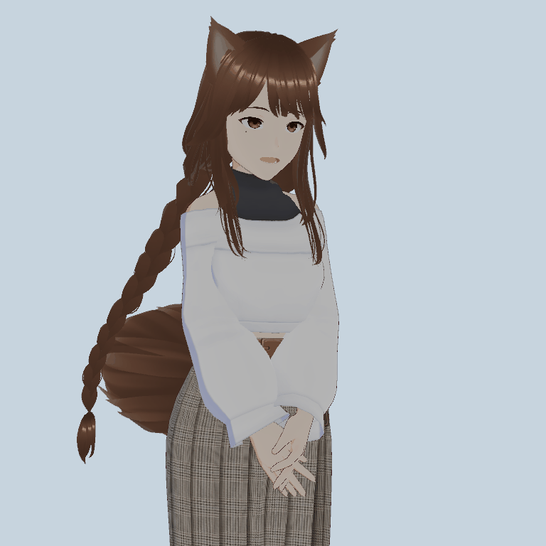
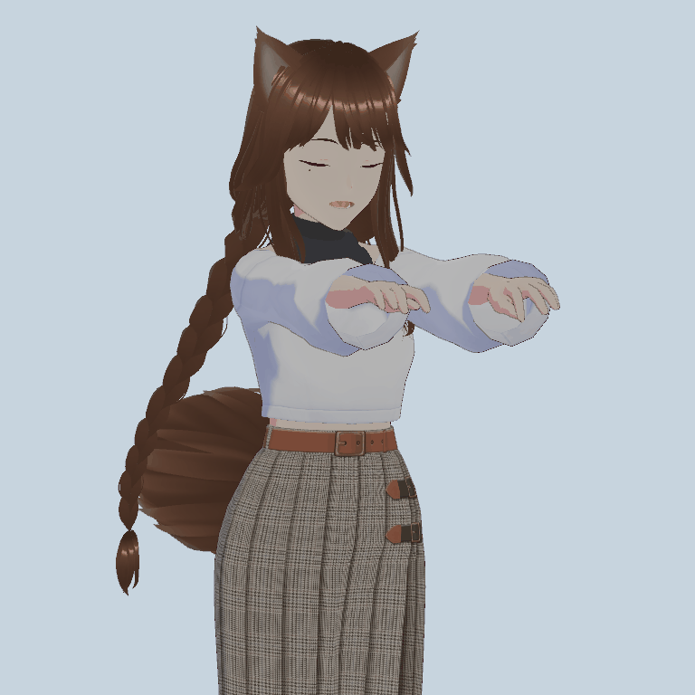

# 姿态约束与局部动作执行

本阶段增加 `compose` 通道：Qwen 给出结构化目标，由本地几何控制器保持指定姿态并执行小幅局部旋转。自由动作继续使用 Qwen → adapter → ARDY；已经验收的四种基本手势继续使用原资源。`compose` 的结果必须标识为约束与曲线控制，不能用来宣称 ARDY 原生生成能力提升。

后续掌向扩展已加入 `leftPalm` / `rightPalm` 和 `axis="palm-normal"`。指定掌向且省略肘角时，方向目标可自动求解肘角；`current` 或明确填写的肘角仍固定。本页下方记录原始无掌向版本的验收，新增协议和实测见 [交流意图与掌向](ardy-palm-and-intent.md)。

## 控制目标

一个计划可以独立指定左右臂目标：不控制、保持实际当前姿态、向前、向侧方、向上、向下或两个向上对角方向。方向基于角色坐标，不是相机坐标；`outward` 根据左右侧取相反方向。每侧肘弯曲角为 0–110°；无掌向目标时默认 8°，接近伸直但避免锁肘。骨长来自当前绑定模型。

局部活动可以作用于左腕、右腕、双腕或头部，选择角色的上、右、前方向作为旋转轴。幅度 1–20°，头部最多 12°；1–3 次往返，局部阶段 1–6 秒，频率不超过 1.5 次/秒。曲线两端平滑进入、退出。手指、抓取、物体接触、下肢和根位移不属于本通道。

示例：

```xml
<motion name="compose" left="forward" right="forward" joint="wrists" axis="up" amplitude="10" cycles="2" seconds="3.2" end="hold"/>
```

它表达双臂前伸、肩肘保持、双腕小幅左右轻摆两次。另一个使用相同机制的组合是双臂 `outward`，局部关节 `head`、旋转轴 `right`、幅度 8°。这些参数不是预录动画文件。

## 执行与观测

骨骼依然由同一个 `ArdyMotionPlayer` 在 Animator 之后写入；不会让两个组件同时覆盖手臂。方向姿态通过两段骨骼的几何求解得到，准备过程平滑过渡。头部和手腕局部曲线与持续手臂目标分离。

`ArdyConstraintObserver` 在 VRM LateUpdate 之后读取实际 Humanoid 骨骼。准备过程约 1.2 秒；方向误差不超过 5°、肘角误差不超过 4°，持续 0.15 秒后才进入局部活动。准备超过 3 秒则退出。执行或持姿时静态手臂误差超过 12°并持续 0.25 秒，或超过 0.5 秒没有新骨骼观测，同样退出。观测值与请求目标分别记录，不能把求解器输出目标本身当作已经执行的证据。

`end="idle"` 完成后回当前 Animator；`end="hold"` 保持终点最多 30 秒。已经进入持姿状态时，用户继续说话不取消该持姿；运动过程中用户开口仍会打断。新动作、明确停止、解绑、故障与超时释放控制。`current` 取最近实际渲染姿态，不能使用尚未播放的服务器未来帧。

`joint="none",end="hold"` 稳定到位后立即进入持姿，不额外等待 `seconds`；`joint="none",end="idle"` 则按 `seconds` 静持后返回。禁用的控制器或播放器拒绝新计划，重新启用后不会突然执行禁用期间的旧请求。

## 入口与诊断

正常聊天继续通过 ARDY Dialogue Motion 连接。Qwen 对明确姿态与局部动作组合使用 `compose`；开放式动作使用 `generate`。能力开关关闭时只保留基础手势，组合参数也不会混入台词或 TTS。相同回复链中同一计划去重，参数不同的计划可正常替换。

编译完成后重新进入 Play Mode 并连接对话动作，可分别试用：

- “双臂向前水平伸直，保持肩肘，手腕左右轻摆两次，最后保持。”
- “双臂向两侧平举，保持手臂，轻轻点一次头。”
- “左臂保持现在的姿势，右臂向前伸直。”（在程序仍显示保持状态时）

本阶段不更换 Qwen、adapter 或 ARDY 权重。已有服务无需重启，约束执行本身也不调用 ARDY 服务。

运行场景后可打开 **Tools → NeEEvA → Pose and Local Motion**，在同一界面组合两侧目标、局部关节、幅度、次数和结束策略。此面板执行同一控制器，不修改场景资产。

约束诊断单独保存在 `Logs/ardy-control`（构建版位于 persistentDataPath），最多八份。包含实际模型参考身份、控制计划、阶段、骨骼观测和退出原因，不记录完整聊天。生成动作的原 `Logs/ardy-live` 继续保留。

## 验证范围

2026-09-10 验证通过：两套真实 VRM、四种根朝向/缩放/更新路径配置，共 49 个实例测试。实际方向误差最大 0.05234°，肘角误差最大 0.01979°；双腕达到约 ±10°并完成两次摆动。侧平举点头、单臂 current/另一臂 forward、六种绝对方向以及 0°/110°肘角边界通过；停止后与继续运行的 Animator 对照误差为 0°。

真实 ChatSample 事件经 Bridge 和 Controller 验证：纯持姿约 1.35 秒到位后立即 holding，开口不丢失已保持姿态，下一次 current 腕动作使用真实渲染姿态；30 秒到期、明确停止、禁用拒绝、准备失败与观察失联均按预期退出。测试不接入私有场景、真实麦克风或语音播放。

原有动作回归也通过：854 项聊天断言、双 VRM 窗口/历史检查、四种原资源和真实嘴型/眨眼更新。实际 Qwen＋adapter＋ARDY HTTP 回归返回三窗、120 帧，完成和取消后均回到原 Animator。

- [约束验收与具体边界](../Tools/MotionAdapter/reports/constrained-execution-v1/acceptance.md)
- [实际源码、原资源与模型发布哈希](../Tools/MotionAdapter/reports/constrained-execution-v1/source-evidence.json)
- [真实 Qwen 规划检查](../Tools/MotionAdapter/reports/composition-diagnosis-v1-compose-protocol-review.json)
- [原自由生成 HTTP 播放回归](../Tools/MotionAdapter/reports/constrained-legacy-http-v1.json)

实际网格回放（动作由新控制器执行；测试嘴型输入为合成数据）：





几何达标不等于整体自然度验收；本阶段也没有实现网格碰撞、肌肉或关节力学、任意复杂舞蹈的控制。它补充的是可组合、可观测的上身约束执行能力。
