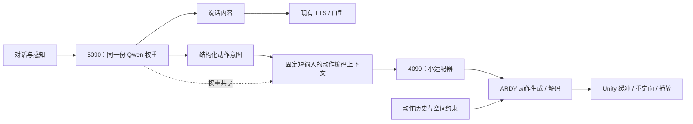

# Qwen 与 ARDY 动作适配器实施方案

更新：2026-09-10。状态：离线适配器试验、已验收四种固定手势，以及共享 Qwen → adapter → ARDY → Unity 的实时上身链路均已实现。真实 Unity Play Mode 已通过三窗续接、实际角色上身历史、取消、迟到结果拒绝和回 Animator 检查。右手固定手势仍为已认可左挥手的明确标注镜像，头部仍为短受控曲线；这不代表所有实时生成动作已通过自然度验收。使用入口与边界见 [对话实时动作](ardy-dialogue-motion.md)，离线背景见 [第一批实测](../Tools/MotionAdapter/reports/pilot-results.md) 和 [固定预览](ardy-unity-preview.md)。

## 当前实测进展

- 本轮新增 1,984 条、248 个配置、29 类上身动作描述，保持原数据与原 checkpoint 不变；锁定的继续训练候选在最终保留 32 组描述上的标准化特征 MSE 下降 43.36%。384 段原生动作审计中，36 个高度观察旧版达到 16、新版 21、教师 32，仍有失败与退步案例。新版已经过真实 HTTP/Unity 检查并激活为默认预览；共享一份 Qwen，初始历史仍为 16 帧。详见 [泛化验证与回放](ardy-generalization.md)。下面原适配器的数字保留为历史阶段结果。

- 已固定 ARDY 与 llama.cpp 源码、Core40 权重修订，建立项目内 ARDY 环境。
- 在 5090 使用实际部署的 Qwen GGUF 完成 2000 条、2048 维特征导出；一份模型、两个独立 context。A/B/A 特征差为 0，8 个聊天生成 token 的交错测试一致。
- 最初 C API 探针现已扩展到共享 HTTP server：28 条缓存抽查逐值误差 0；动作前后聊天槽状态和 KV 续写一致，实际视觉请求通过。保留三个 65536-token 聊天槽及独立 512-token 动作 context，只有一份 Qwen；尚未进行长时生产语音并发、三个槽同时填满及完整 p95 压力验收。
- 本机 4090 已在 `text_encoder=False` 下运行 Core40，10 步生成 40 帧、27 关节动作；无文本条件、无后处理，不是原版文本动作基线。
- 原版教师特征和四组适配器训练已完成，验证集选中的 MLP seed 1 在保留测试集上特征余弦相似度为 0.98838。
- 两种适配器各完成 10 组教师/学生动作生成；MLP 对齐根后的全身关节平均差约 1.87 cm，但小幅慢速挥手在原版冷启动样本中也不明显，不能以模仿误差代替指令遵循评价。7 项代码测试通过。
- 用户授权的 Llama/LLM2Vec 仅在离线导出时加载。此后适配器训练读取缓存，ARDY 动作对比使用 `text_encoder=False`，没有加载第二个语言模型。
- 已生成三窗连续、每段六秒的原始动作，并实现 `ArdyMotionClip` 与 `ArdyMotionPlayer`，支持遮罩、插值、切换和停止渐变。单臂动作改为源胸部相对运动应用到当前目标胸部；完整真实骨架重定向进一步发现原右挥手仍遮脸。比较同一右手条件的 seed 0/1/2/3 后，当前右手演示选用已认可左挥手的镜像，保留原左手生成条件与派生记录；这不能算作原生右手生成能力的通过。
- 原始点头/摇头候选虽曾通过可见幅度筛选，但已被用户否定为不自然。当前按钮使用显式受控头部曲线：8° 温和点头约 1.85 秒，左右各 6° 摇头约 2.05 秒，回正并作为局部偏移叠加当前姿态。原始 NPZ、条件/模型 SHA、文本和指标保留为审计来源；这不是 ARDY 原生改善、适配器重训结果或泛化评估。
- 实时本地服务每次生成 40 新帧，内部续接 16 帧历史，最多三窗；角色 revision、取消 tombstone、队列和超时有界。Unity 对实际渲染上身重采样，逆映射 Core27 并通过官方运动表示构造初始历史。根/腿和接触为静止投影，不能视为完整身体捕获。
- 针对用户反馈的动态举手歪身，已发现投影把根相对 Hips 零点误用为世界高度，导致脚位于地下。现按源脚/脚趾推导站立高度；同条件、同种子、同真实 Animator 历史的举手对照中，真实 VRM 躯干最大倾斜约 48° → 3°。这修复的是历史输入；当前双手举过头顶仍常只抬一侧，不能算作双手动作通过。详见 [生成动作诊断](../Tools/MotionAdapter/reports/generated-motion-diagnosis.md)。
- 身体动作已与自动续说生命周期分离，同一回复链中的相同动作去重；用户输入、开口、明确新动作和停止仍可打断。真实 ChatSample 的 167 项断言通过。新增最近八次生成的精确动作请求/历史/响应日志，后续可复现；固定四手势资源与正式重定向播放器未变。
- 修复高度后的正式服务真实 Unity HTTP 联调首窗约 1.37 秒、三窗约 1.75 秒收齐，16 帧真实初始历史，正确播放 120 帧；正常结束和中途取消后，与同步 Animator 对照的旋转误差在 Unity 精度下为 0°。此前 0.61 / 0.99 秒为旧版本少量记录，已归档。这些样本不代表动态动作主观自然度或完整系统延迟分布。

## 目标与第一版范围

运行时复用一份 Qwen3.6-35B-A3B 权重，负责角色对话、动作意图与动作描述的特征提取；增加一个小适配器和 ARDY 动作网络。Llama/LLM2Vec 仅用于离线制作教师特征，不常驻在线系统。

第一版冻结 Qwen 与 ARDY，只训练适配器。先验证挥手、解释性手势、改变站姿和转身，再扩展走动。坐下、拿取物体、语音重音同步和精细手指控制另行验收。

这是一条待验证的迁移路线，不能预先保证小适配器完整保留原编码器的能力。

## 已核实的接口与本地条件

- ARDY Core40 配置的文本条件形状为 `[1, 4096]`，动作原生帧率 20，预测窗口 40 帧，每个动作 token 对应 4 帧。[官方配置](https://huggingface.co/nvidia/ARDY-Core-RP-20FPS-Horizon40/blob/main/config.yaml)
- 官方 LLM2Vec wrapper 为每个描述输出一个向量，再添加长度为 1 的序列维度，且将编码器冻结。教师特征必须使用该 wrapper 及其实际模型配置，保留原始数值尺度。[wrapper](https://github.com/nv-tlabs/ardy/blob/main/ardy/model/llm2vec/llm2vec_wrapper.py)
- `load_model(..., text_encoder=False)` 可不加载编码器；`autoregressive_step(..., text_feat=..., text_pad_mask=...)` 可直接接收条件。[加载器](https://github.com/nv-tlabs/ardy/blob/main/ardy/model/load_model.py)、[推理实现](https://github.com/nv-tlabs/ardy/blob/main/ardy/model/ardy_model.py)
- Qwen3.6-35B-A3B 官方隐藏维度是 2048；线上提取时仍须实际校验形状。[Qwen 模型卡](https://huggingface.co/Qwen/Qwen3.6-35B-A3B)
- 本地部署为 5090 运行 Qwen，4090 运行 Unity 和语音。`Tools/Remote/neeeva_remote_llm.ps1` 当前配置 3 个槽、总上下文 196608，分别服务主对话、辅助理解和轮次判断；每槽 65536。文档中较早的空闲显存数字不能代替当前峰值测量。
- b8919 文档将 `--embeddings` 描述为专用嵌入用途；原生 `/embeddings` 文档支持 pooling none 返回逐 token 未归一化特征。这不能证明当前 Qwen、视觉投影和聊天配置可直接混用，必须执行阶段 0。[对应版本文档](https://github.com/ggml-org/llama.cpp/blob/b8919/tools/server/README.md)

## 运行架构



此图描述目标在线架构。当前 Unity 按钮读取固定资源，尚未连接该实时链路；受控头部交流曲线是独立的、明确标注的播放方式，不作为 Qwen → 适配器 → ARDY 生成质量的证据。

第一版允许对每个新动作多做一次短输入前向计算，且按动作描述缓存。共享模型权重不等于零额外计算；不要每个动画帧重新调用 Qwen。

动作编码输入只含固定模板与规范化英文动作描述。对话仍可用日语或中文，动作目标从对话里解析。第一版不从任意长聊天上下文的最后 token 直接提取特征，避免同一动作因聊天背景不同而变成不同分布。

## 阶段 0：验证单份 Qwen 的特征出口

先在验证环境确认，再改生产服务。不要启动第二份 Qwen 来冒充权重共享。

1. 固定当前 Qwen GGUF、tokenizer、chat template 和 llama.cpp build，记录版本或校验和。
2. 用少量固定动作描述探测原生特征接口是否适用于该模型；检查返回的是隐藏特征而非词表 logits，明确层、pooling、特殊 token 与归一化策略。
3. 候选特征包括动作结束位置的最后隐藏向量，以及仅动作正文 token 的平均隐藏向量。用小验证集选择并冻结一种；不得训练时用 mean、上线时换 last。
4. 必须保证动作特征上下文独立、每次请求清除上一动作的循环状态/KV，且不清除主对话缓存。若现有接口无法满足，在同一进程内复用 `llama_model`，建立一个短 `llama_context`（初始预算 256–512 token），增加自定义特征路由。路由名属于本项目设计，不是上游现成接口。
5. 串行调度或经过验证的调度器控制聊天/特征计算竞争。动作编码低于主对话和轮次判断优先级，缓存命中直接返回。验证超时、空闲恢复和多请求交错时不会串状态。
6. 不直接把 `--parallel 3` 改为 4 并保持总上下文不变，那会压缩现有每槽预算。是否使用额外短 context 或重新分配槽，要根据内存和接口实测决定。

验收：同一文本重复编码可复现；无重复 Qwen 权重；不污染主对话缓存；聊天/视觉/轮次判断仍可用；量出新增延迟、峰值显存和排队时间。未通过时，先解决特征出口，不批量生产训练数据。

## 阶段 1：建立原版动作基线与配对特征数据

### 原版动作基线

独立安装 ARDY，先使用 Core40 的默认推理配置，不同时改变编码器、骨架、扩散步数和后处理。离线缓存 LLM2Vec 向量，然后卸载它，验证无编码器加载模式能复现对应动作。

固定一批动作描述、随机种子、姿态历史及约束，保存原版生成结果；后续学生适配器使用完全相同的条件比较。原版本身失败的动作单独记录，不能全部归咎于迁移。

### 文本数据

初始工程预算：约 2000 条描述做可行性试验；有效后扩到 1–2 万条。数量是起点，不是足够覆盖全部动作的保证。

覆盖动作类别、左右手、方向、速度、幅度、站立/坐姿状态、停止及简单组合。优先使用可观察的物理描述，例如：

```json
{
  "id": "wave_right_small_001",
  "semantic_group": "wave_right_small",
  "text": "A person stands in place and waves the right hand gently.",
  "split": "train"
}
```

同义改写归入同一 semantic group，按组划分训练/验证/测试；另建未见组合测试集。不能随机拆散近乎相同的改写来报告泛化效果。人工抽查描述是否明确、物理合理，并覆盖与 NeEEvA 相关的动作。

对每条相同英文描述，分别离线生成：

- `qwen_features`：所选 Qwen 特征，形状 `[N, 2048]`。
- `teacher_features`：原版 LLM2Vec 特征，形状 `[N, 4096]`。
- `manifest`：文本、分组、数据划分、模型与模板版本、pooling、归一化、编码批次与环境版本。

优先从实际部署的量化 Qwen 生成训练特征。如果原型先用 Transformers，则其成果仅用于验证路线，上线前必须在实际 GGUF 特征上重新训练或校准并验收。

两套特征可以先后计算并落盘，不要求 Qwen 和 Llama 同时放进一块显卡。2 万条两套 float32 特征约 469 MiB（不含文本与其他元数据）。

## 阶段 2：训练适配器

先建立一个带偏置的线性映射基线，再与以下 MLP 比较：

```text
输入 q：[B, 2048]
LayerNorm(2048)
Linear(2048, 2048)
GELU
Linear(2048, 4096)
输出 z：[B, 4096]
```

MLP 约 1260 万参数，纯 BF16 权重约 24 MiB；优化器、梯度、临时张量和框架仍会额外占内存。

教师特征按训练集统计量逐维标准化，保存均值与标准差；标准差设置下限。适配器预测标准化特征 z，再还原到原版条件空间：

```text
target_z = (teacher - mean) / std
pred_teacher = adapter(qwen) * std + mean
loss = MSE(adapter(qwen), target_z)
     + 0.1 * (1 - cosine_similarity(pred_teacher, teacher))
```

0.1 为初始实验权重。不得仅把输出归一化到单位长度后传给 ARDY，那会改变原始条件的幅值。

起始超参数可用 AdamW、学习率 1e-4、batch 256、weight decay 1e-2；按验证集早停并比较多个种子。只训练适配器，使用缓存特征，不保留 Qwen/Llama 反向图。用验证集选模型，不用最终测试集反复调参。

验收同时包含：向量误差、范数分布、同义改写一致性、左右/快慢等易混淆条件，以及实际 ARDY 动作。低向量误差不能替代动作验收。

## 阶段 3：接 ARDY 服务

使用官方 `load_model(..., text_encoder=False)`，保持原版动作网络冻结。接入时进行以下转换：

```text
qwen_feature [B, 2048]
  -> adapter + inverse_standardization
teacher_space_feature [B, 4096]
  -> unsqueeze(sequence_axis)
text_feat [B, 1, 4096]
text_pad_mask [B, 1] = True
  -> autoregressive_step(历史、约束、原版推理参数、以上文本条件)
  -> motion_rep.inverse(...)
  -> root_positions / local_rot_mats / foot_contacts
```

实现时以所固定版本的实际返回值为准。新输入至少校验维度、finite、特征版本和范数范围。

动作网络保留各角色自己的历史、坐标原点和随机数状态。每次动作描述变化只更新文本条件，不清空全部身体历史。位置和接触目标使用 ARDY 的数值约束通道，不靠文本近似三维坐标。

服务维护短播放缓冲，按实测推理耗时设置重规划阈值。40 帧是预测窗口，不代表必须先播放完两秒才能响应。新意图可取消尚未播放的远期帧，从当前姿态与保留的短历史重规划。

自定义请求需有 `character_id`、`turn_id`、`motion_revision`、取消标识和时间戳，迟到响应不能重新激活已取消动作。错误或欠载时淡回已有 idle，不能在原地无限重发失败请求。

## 阶段 4：接入 NeEEvA

先定义动作意图结构，再接当前输出解析器。示例字段属于拟新增协议：

```json
{
  "turn_id": "turn-123",
  "motion_revision": 7,
  "description": "A person stands in place and waves the right hand gently.",
  "duration_s": 2.0,
  "root_policy": "stationary",
  "interruptible": true
}
```

动作放在结构化控制通道，解析完整后执行，不能进入 TTS 正文。对话输出可以先继续发声；动作服务异步运行。第一版使用提示词约束即可，先不对 Qwen 做动作指令 LoRA。

模块及当前状态：

| 模块 | 职责 |
| --- | --- |
| `Tools/MotionAdapter/` | 已创建：文本、Qwen 探针、教师导出、训练和离线动作对比脚本 |
| `Server/ARDY/motion_service/` | 在线服务、官方历史变换、GPU 串行工作器、健康检查、超时和取消 |
| `Assets/AIChatTookit/Scripts/Chat/DialogueMotionIntent.cs` | 动作协议与轮次身份；`ChatSample.Motion.cs` 与 bridge 接对话事件 |
| `.../Motion/ArdyLiveProtocol.cs` | HTTP DTO、显式可选历史序列化、响应校验 |
| `.../Motion/ArdyLiveMotionController.cs` | 异步 HTTP、实际姿态重采样、取消与续窗 |
| `.../Motion/ArdyMotionClip.cs` | Core27 旋转契约与采样插值 |
| `.../Motion/ArdyMotionPlayer.cs` | 骨骼重定向、三窗追加、遮罩和 Animator 控制权交接 |

以上为当前实际实现文件；运行入口和版本化协议见 [对话实时动作](ardy-dialogue-motion.md)。更大范围的生成自然度和完整语音时序仍须单独验收。

原始 ARDY 动作的局部遮罩需保留正确的身体参照：单臂动作先相对于源胸部取姿态，再应用到当前目标胸部，不能只保留源手臂全局朝向而丢弃源转胸。当前受控头部资源采用 `additive-local` 标记，在现有 Animator 姿态上叠加 Neck/Head 偏移；其余身体骨骼继续由原系统控制。这一受控曲线不取代后续对 ARDY 头部指令、共同历史和完整往返动作的验证。

重定向处理 Core 四段脊柱到角色 spine/chest/upperChest、左右与坐标系、初始姿态、骨长比例。优先使用根位置和局部旋转驱动角色，保留原模型骨长；不能直接用源骨架全部世界坐标覆盖角色。

动作姿态进入 UniVRM ControlRig/运行更新前，协调注视与 SpringBone。口型、眨眼、手指默认姿态继续独立工作。具体时序必须在实际场景验证，不能简单依赖一个未排序的 LateUpdate。

## 当纯向量蒸馏效果不足

先判断问题来自 Qwen 特征、描述覆盖、原版动作失败，还是重定向。只有确认是条件迁移不足后，增加动作感知蒸馏或少量条件层微调。

可让原版教师条件与学生条件在相同噪声、时间步、历史及约束上经过同一个去噪器，比较预测的根与身体 latent。学生分支对适配器保留梯度；教师分支 no_grad。需要明确采样哪些有效动作上下文和时间步，不能用任意高斯数据代替完整分布验证。

官方公共采样流程包含 `inference_mode`/`no_grad`，不能直接在 `autoregressive_step` 外加一个 loss 就训练。需要针对底层 PyTorch denoiser 实现训练入口，并验证适配器梯度非零、被冻结的参数不变化。进一步使用动作数据时，再评估解码姿态、接触和约束损失。[去噪器源码](https://github.com/nv-tlabs/ardy/blob/main/ardy/model/auto_latent_twostage_denoiser.py)

## 统一验收与交付顺序

验收至少记录：

- 原版教师与学生在相同条件下的动作遵循率，单列左右手、速度、幅度和未见组合；双盲或隐藏来源的人工比较辅助自动指标。
- 重定向后的足滑、根漂移、关节越界、穿模和切换跳变。
- 指令到动作、编码、排队、生成、网络与播放缓冲分别的 p50/p95；生成耗时必须低于播放缓冲能覆盖的时间。
- 主对话首音延迟、轮次判断、视觉请求和歌唱/语音并发，相对同场景基线的变化。
- 正常峰值显存、长时间运行内存趋势、服务断开、取消和迟到包处理。

第一批交付应是：单份 Qwen 特征出口的验证报告、可重放的教师动作基线、2000 条试验特征与线性/MLP 对比。通过后扩大数据并接 Unity。最终交付再包含适配器权重及统计量、数据/模型版本清单、完整服务和动作回归报告。

当前实测范围见本文开头及工具目录的报告。尚未完成的训练与集成步骤仍是实施方案；数据量、网络结构和超参数不代表已验证的动作效果。
